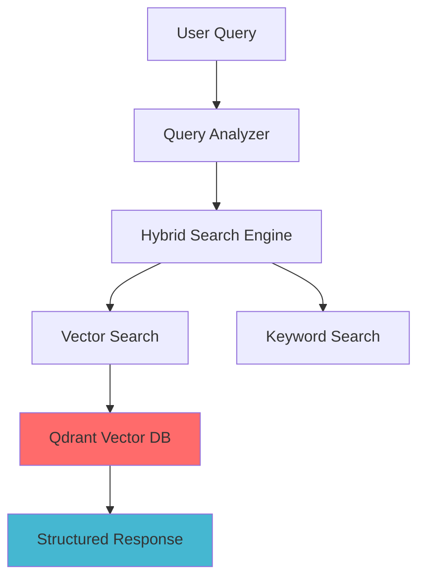

# GreekLawCase-RAG

## Problem Statement

Existing Greek case law databases are notoriously slow, outdated, and rely on rigid, exact-match keyword searches. This creates a massive inefficiency: finding semantically similar precedents takes hours of manual filtering through clunky interfaces. This not only wastes valuable time but increases the risk of missing crucial, relevant law cases.

## 💡 The Solution: A RAG-Powered Legal Vector Database

**GreekLawCase-RAG** bridges the gap between outdated Greek legal infrastructure and modern AI capabilities. By replacing traditional databases with a vector database and a RAG pipeline, it enables semantic search across thousands of Greek legal cases.

### 🚀 How It Solves the Problem?
- **⚙️ Production-Ready**: Docker containerization for enterprise-scale workloads
- **🧠 Hybrid Search**: Combines semantic vector search with keyword matching
- **📈 High Performance**: Use of optimized Qdrant configurations for high speed and accuracy

## 📋 Key Features

<table>
<tr>
<td width="50%">

### 🔍 **Advanced Search Engine**
- **Semantic Understanding**: Grasps the context of queries
- **Hybrid Search**: Combines vector similarity and keyword matching (70% vector search, 30% keyword search)

### 🖥️ **Intuitive User Interface**
- **Easy to Use Search Interface**: Ability to adjust the number of results returned, provides links for law cases 

</td>
<td width="50%">

### ⚙️ **Production Features**
- **Docker Containerization**: Easy deployment
- **Horizontal Scaling**: Optimized Qdrant architecture
- **Monitoring & Logging**: Built-in observability to track system health and search latency

### 📊 **Analytics & Insights**
- **Performance Monitoring**: Real-time metrics dashboard
- **A/B Testing**: Compare different hybrid search weights

</td>
</tr>
</table>

## 🏗️ System Architecture

## 🚧 Challenges and Solutions

Building a RAG system for a highly specific and complex domain like Greek jurisprudence comes with unique technical hurdles. While the current version solves the core search problem, the following challenges are the primary focus for the next iterations of this project:

### 1. 📈 Scaling Vector Search for Massive Datasets
* **The Challenge:** As the database ingests decades of Greek case law, performing high-dimensional vector searches at scale will increase latency and memory consumption.
* **The Solution:** 
  * Implement **quantization** (scalar and product) in Qdrant to significantly reduce the memory footprint of vectors without sacrificing recall.
  * Fine-tune **Qdrant HNSW index settings** (e.g., `m`, `ef_construct`).
  * Introduce a **Redis-based caching layer** to instantly intercept and serve frequent or repetitive legal queries.

### 2. 🧩 Optimizing the Chunking Strategy
* **The Challenge:** Greek legal documents have highly nested and rigid structures (Laws -> Articles -> Paragraphs -> Sub-paragraphs). Standard recursive text splitting often breaks these semantic boundaries, losing crucial context.
* **The Solution:** 
  * Build an automated evaluation pipeline to perform **A/B testing** across various chunking techniques.
  * Experiment with **Semantic Chunking** and **Document-Structure-Aware Parsing** (using regex or ASTs to respect the hierarchy of legal articles) to ensure chunks retain their complete legal meaning.

### 3. 🧠 Advanced Data Processing & Entity Extraction
* **The Challenge:** Currently, the system relies on raw text embeddings. It lacks a structured understanding of the specific legal entities mentioned within the texts.
* **The Solution:** 
  * Integrate advanced **NLP techniques (specifically Named Entity Recognition - NER)** tailored for the Greek language.
  * Automatically extract and tag specific entities such as **cited legislation** (e.g., *Ν. 4139/2013*), **legal terminology**, **penalty types**, and **dates**.
  * Use these extracted entities to enable **metadata filtering** (e.g., "Find cases similar to X, but *only* if they cite Law Y").

## 🛠️ Tech Stack

### Prerequisites
- Python 3.8+
- Docker
- OpenAI API Key

### 🚀 Getting Started - Installation